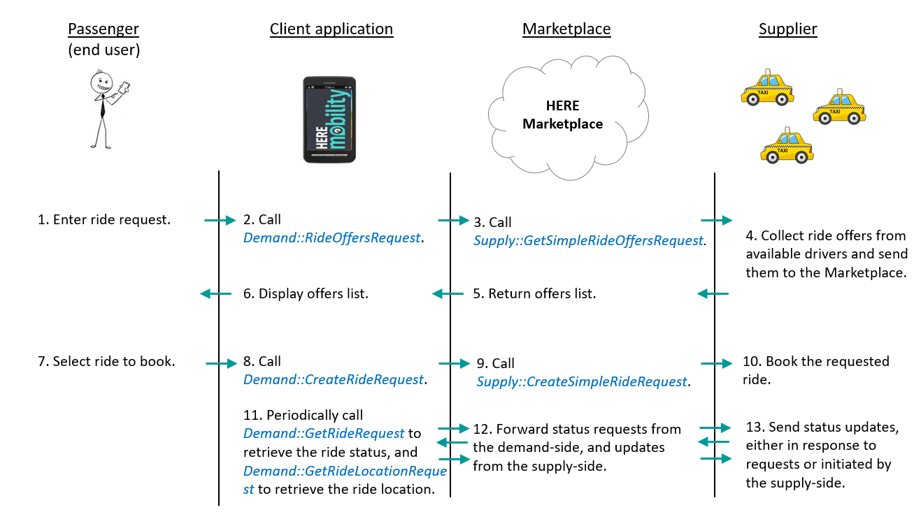

# HERE Supply API Common Workflows #

The diagram below illustrates the workflow for booking a ride and updating its status during the ride. 

Note: The diagram below shows calls to both the HERE Mobility Demand and Supply APIs, to illustrate the interaction between the demand and supply sides.
 

----
The pages listed below describe some common workflows you can implement using the Supply API. 

The descriptions include code samples for the REST and GRPC interfaces.

- [**Dispatch callback**: Respond to a Request for Ride Offers]()
- [**Dispatch callback**: Respond to a Passenger Request to Book a Ride]()
- [**Dispatch callback**: Respond to a Passenger Request to Cancel a Ride]()
- [**Dispatch callback**: Respond to a Request for a Ride's Status]()
- [**Supplier-initiated**: Cancel a Ride]()
- [**Supplier-initiated**: Update a Ride's Details]()

